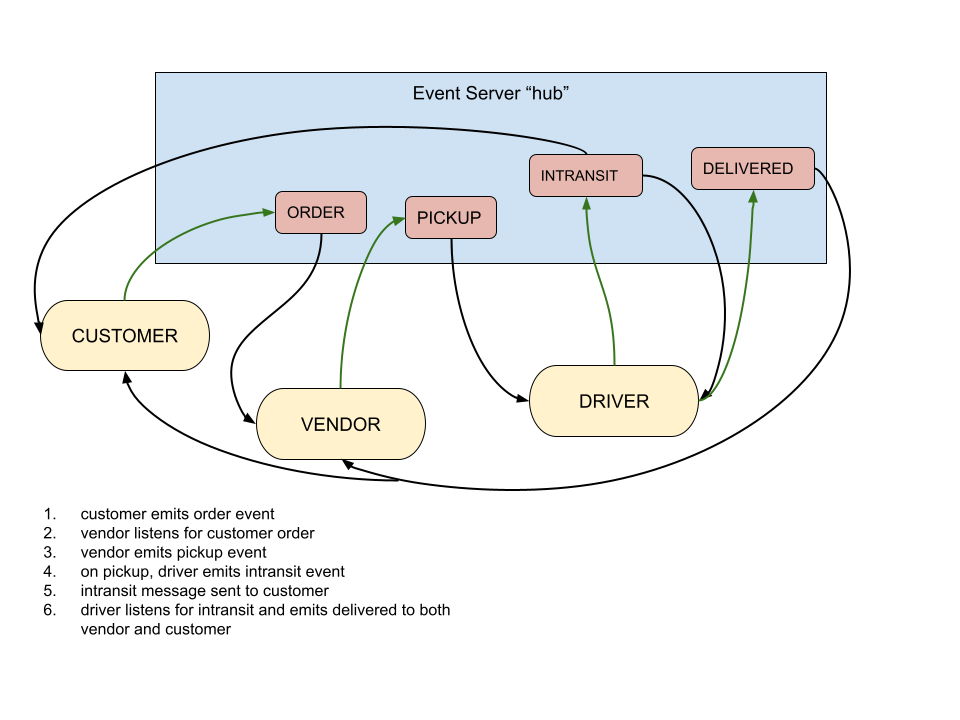

# Lab 14 - Event App

## Authors: Katharine Swilley and Cody Davis

## Problem Domain

Create an application that uses real-time events.

Employs the following programming concepts:

- A “hub” server that moderates all events
- Multiple “clients” that connect to the hub which can both publish and subscribe to events
- Must operate over a network

## Features

### Listeners

- `ORDER`
- `PICKUP`
- `INTRANSIT`
- `DELIVERED`

## UML

